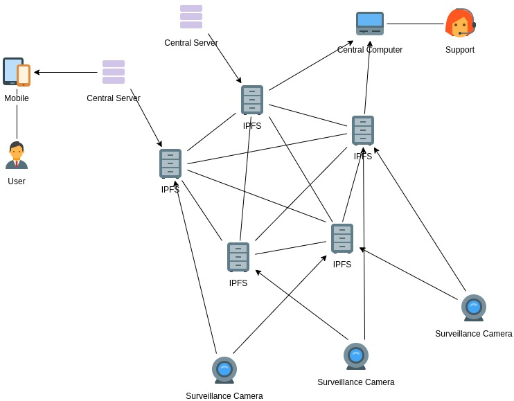
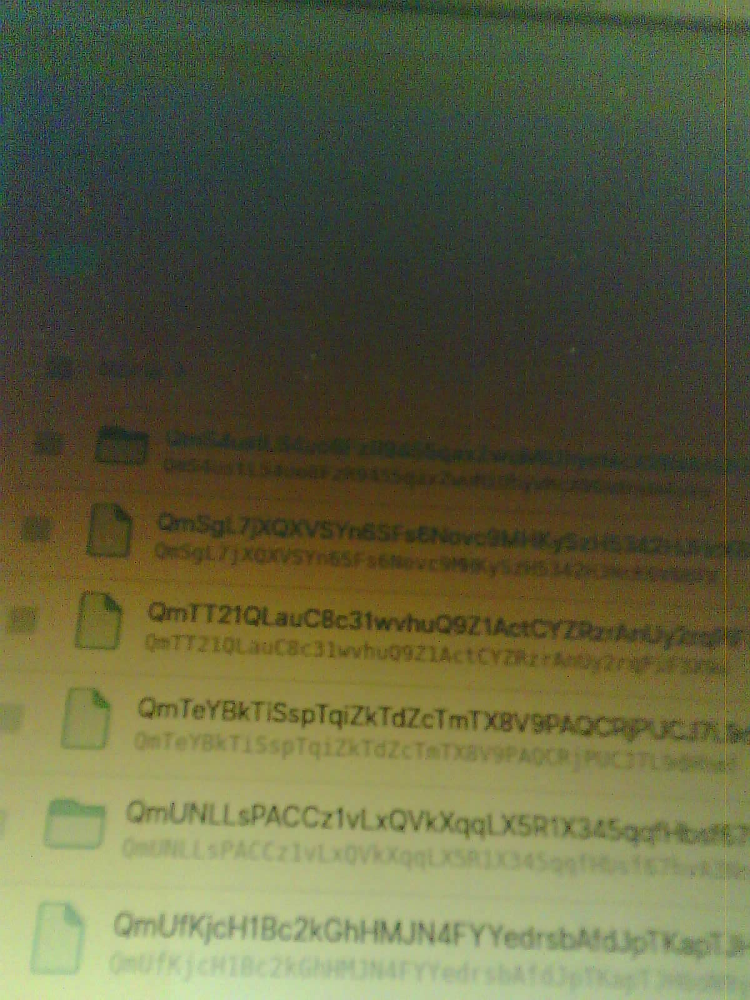

<div align="center">
    
    <h1>Surveillance</h1>
</div>

> Surveillance is the monitoring of behavior, activities, or information for the purpose of influencing, managing or directing. This can include observation from a distance by means of electronic equipment, such as closed-circuit television (CCTV), or interception of electronically transmitted information, such as Internet traffic. - [Wikipedia](https://en.wikipedia.org/wiki/Surveillance)

This is an example of how it's possible to interact with solidity contracts, directly from an IoT device, using the JSON-RPC. Besides that, for this example, every time the IoT device starts, a picture is taken and uploaded to a private IPFS network, also, directly from the IoT device.

**Note**: The IoT device used here is an ESP32cam, AI THINKER model.

Thanks to:
* [randomnerdtutorials - esp32 cam take photo save microsd card](https://randomnerdtutorials.com/esp32-cam-take-photo-save-microsd-card/)
* [stackoverflow - ESP32 send image file with HTTPClient](https://stackoverflow.com/q/53264373/3348623)
* [stackexchange - How to call a contract method using the eth_call JSON-RPC API](https://ethereum.stackexchange.com/a/3520)

## What's happening?

The image below represents what can be an extended version of this example. Using a network of IPFS nodes, a camera connects to a group of nodes and uploads a picture or a video. After that, there will be a group of people in an office, supporting the system. Consider that as any CCTV or alike support team.

At the infographic is also represented the central server and mobile -> user. That is not in this example. That is an example of central server with AI system watching traffic or human behaviour to respectively redirect traffic or predict crimes.



## For developers

This example uses an ESP32cam AI THINKER model, as said above, with an OV2640 camera. The example requires an SD card, since it's also saving the picture to it. Although, you can remove that part of the code.

**Note**: This code might require to open 5001 and 8545 ports on your router. It will also require to [accept files on IPFS from anywhere](https://discuss.ipfs.io/t/i-can-not-access-my-file-through-a-gateway-or-another-node/5598/2).

```bash
# example of sending ETH between accounts
curl -H "Content-type: application/json" -X POST --data '{"jsonrpc":"2.0","method":"eth_sendTransaction","params":[{"from":"0xe8a5e64E6EBb88F7DdCE7C91723e4d92b73B8FFc","to":"0xB1d9253c58E263242D8B8a790D486D20e64610DC","gas":"0x15f90","gasPrice":"0x430e23400","value":"0x9b6e64a8ec60000"}],"id":"1"}' http://localhost:8545

# get the value using a method like: function get() public view returns (uint256)
curl localhost:8545 -X POST --data '{"jsonrpc":"2.0", "method":"eth_call", "params":[{"from": "0xe8a5e64E6EBb88F7DdCE7C91723e4d92b73B8FFc", "to": "0xe6FC07BD5191cda108F989AA3011208BdE0DE135", "data": "0x6d4ce63c0000000000000000000000000000000000000000000000000000000000000000"}], "id":1}'

# set a value using a method like: function set(uint256 x) public
curl localhost:8545 -X POST --data '{"jsonrpc":"2.0", "method":"eth_sendTransaction", "params":[{"from": "0xe8a5e64E6EBb88F7DdCE7C91723e4d92b73B8FFc", "to": "0xe6FC07BD5191cda108F989AA3011208BdE0DE135", "data": "0x60fe47b10000000000000000000000000000000000000000000000000000000000000007"}], "id":1}'
```

The result of a picture taken by the camera to my laptop screen. I've realized that, this camera is great, but not taking pictures to screens.

